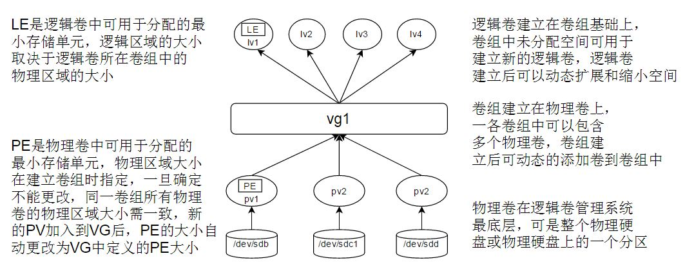

# LVM

LVM是逻辑盘卷管理（Logical Volume Manager）的简称，它是Linux环境下对磁盘分区进行管理的一种机制，LVM是建立在硬盘和分区之上的一个逻辑层，来提高磁盘分区管理的灵活性。LVM是在磁盘分区和文件系统之间添加的一个逻辑层，来为文件系统屏蔽下层磁盘分区布局，提供一个抽象的盘卷，在盘卷上建立文件系统。物理卷（physical volume）物理卷就是指硬盘分区或从逻辑上与磁盘分区具有同样功能的设备（如RAID），是LVM的基本存储逻辑块，但和基本的物理存储介质（如分区、磁盘等）比较，却包含有与LVM相关的管理参数。

优势：
- 能够在线扩容当前的分区容量。

# LVM operations



## Prepare the separated disk or physical partitions
```
# fdisk -l

Disk /dev/sda: 43.1 GB, 43055710208 bytes, 84093184 sectors
Units = sectors of 1 * 512 = 512 bytes
Sector size (logical/physical): 512 bytes / 512 bytes
I/O size (minimum/optimal): 512 bytes / 512 bytes
Disk label type: dos
Disk identifier: 0x0008ee49

   Device Boot      Start         End      Blocks   Id  System
/dev/sda1   *        2048     1026047      512000   83  Linux
/dev/sda2         1026048    84092927    41533440   8e  Linux LVM

Disk /dev/mapper/centos-root: 38.3 GB, 38319161344 bytes, 74842112 sectors
Units = sectors of 1 * 512 = 512 bytes
Sector size (logical/physical): 512 bytes / 512 bytes
I/O size (minimum/optimal): 512 bytes / 512 bytes


Disk /dev/mapper/centos-swap: 4160 MB, 4160749568 bytes, 8126464 sectors
Units = sectors of 1 * 512 = 512 bytes
Sector size (logical/physical): 512 bytes / 512 bytes
I/O size (minimum/optimal): 512 bytes / 512 bytes


Disk /dev/sdb: 4294 MB, 4294967296 bytes, 8388608 sectors
Units = sectors of 1 * 512 = 512 bytes
Sector size (logical/physical): 512 bytes / 512 bytes
I/O size (minimum/optimal): 512 bytes / 512 bytes
```

## Create physical volume
物理卷（Physical Volumes）简称PV，是在磁盘的物理分区或与磁盘分区具有同样功能的设备（如RAID)上创建而来。它只是在物理分区中划出了一个特殊的区域，用于记载与LVM相关的管理参数。
物理卷：Physical Volume，简称PV，一个物理卷只不过是一个有LVM管理数据添加在里面的物理存储介质。要使用LVM系统，首先对要用于LVM的磁盘进行初始化，初始化的目的就是将磁盘或分区标识为LVM 的物理卷。使用pvcreate 命令可以将一个磁盘标记为 LVM 物理卷。 
```
# pvcreate /dev/sdb 
  Physical volume "/dev/sdb" successfully created
# pvdisplay /dev/sdb
  "/dev/sdb" is a new physical volume of "4.00 GiB"
  --- NEW Physical volume ---
  PV Name               /dev/sdb
  VG Name               
  PV Size               4.00 GiB
  Allocatable           NO
  PE Size               0   
  Total PE              0
  Free PE               0
  Allocated PE          0
  PV UUID               dHkPFm-RrAY-G7ak-BDox-AZrU-AfSj-i4UGzO
```

## Create volume group

卷组（Volume Group）简称VG，它是一个或者多个物理卷的组合。卷组将多个物理卷组合在一起，形成一个可管理的单元，它类似于非LVM系统中的物理硬盘。 
当多个物理卷组合成一个卷组后时，LVM会在所有的物理卷上做类似格式化的工作，将每个物理卷切成一块一块的空间，这一块一块的空间就称为PE（Physical Extent ），它的默认大小是4MB。 
由于受内核限制的原因，一个逻辑卷（Logic Volume）最多只能包含65536个PE（Physical Extent），所以一个PE的大小就决定了逻辑卷的最大容量，4 MB 的PE决定了单个逻辑卷最大容量为 256 GB，若希望使用大于256G的逻辑卷，则创建卷组时需要指定更大的PE。在Red Hat Enterprise Linux AS 4中PE大小范围为8 KB 到 16GB，并且必须总是 2 的倍数。 

物理分区：Physical Extents，简称PE，LVM将每个物理卷分别叫做物理分区的可寻址存储单元，存储单元的大小通常为几MB。磁盘的开头部分为LVM元数据，之后从索引为零开始，每个物理分区的索引依次递增一，按顺序进行分配。
```
# vgcreate myvg /dev/sdb
  Volume group "myvg" successfully created
# vgdisplay myvg
  --- Volume group ---
  VG Name               myvg
  System ID             
  Format                lvm2
  Metadata Areas        1
  Metadata Sequence No  1
  VG Access             read/write
  VG Status             resizable
  MAX LV                0
  Cur LV                0
  Open LV               0
  Max PV                0
  Cur PV                1
  Act PV                1
  VG Size               4.00 GiB
  PE Size               4.00 MiB
  Total PE              1023
  Alloc PE / Size       0 / 0   
  Free  PE / Size       1023 / 4.00 GiB
  VG UUID               j7LufK-yFBa-iwio-67O0-o6aw-odNk-CFsEgG
# pvdisplay /dev/sdb 
  --- Physical volume ---
  PV Name               /dev/sdb
  VG Name               myvg
  PV Size               4.00 GiB / not usable 4.00 MiB
  Allocatable           yes 
  PE Size               4.00 MiB
  Total PE              1023
  Free PE               1023
  Allocated PE          0
  PV UUID               dHkPFm-RrAY-G7ak-BDox-AZrU-AfSj-i4UGzO
```

## Create logic volume

逻辑卷（Logical Volumes）简称LV，是在卷组中划分的一个逻辑区域，类似于非LVM系统中的硬盘分区。
同卷组一样，逻辑卷在创建的过程中也被分成了一块一块的空间，这些空间称为LE（Logical Extents），在同一个卷组中，LE的大小和PE是相同的，并且一一对应。
```
# lvcreate -L 100M -n mylv1 myvg
  Logical volume "mylv1" created.
# lvs
  LV    VG     Attr       LSize   Pool Origin Data%  Meta%  Move Log Cpy%Sync Convert
  root  centos -wi-ao----  35.69g                                                    
  swap  centos -wi-ao----   3.88g                                                    
  mylv1 myvg   -wi-a----- 100.00m
# lvdisplay myvg
  --- Logical volume ---
  LV Path                /dev/myvg/mylv1
  LV Name                mylv1
  VG Name                myvg
  LV UUID                WMe0rF-7inv-OcvN-AWGH-pQzP-q5HT-CGfqFl
  LV Write Access        read/write
  LV Creation host, time centos7host4.wyq.com, 2016-12-25 07:41:15 -0500
  LV Status              available
  # open                 0
  LV Size                100.00 MiB
  Current LE             25
  Segments               1
  Allocation             inherit
  Read ahead sectors     auto
  - currently set to     8192
  Block device           253:2                                               
```

## Create file system
```
# mkfs -t ext3 /dev/myvg/mylv1
mke2fs 1.42.9 (28-Dec-2013)
Filesystem label=
OS type: Linux
Block size=1024 (log=0)
Fragment size=1024 (log=0)
Stride=0 blocks, Stripe width=0 blocks
25688 inodes, 102400 blocks
5120 blocks (5.00%) reserved for the super user
First data block=1
Maximum filesystem blocks=67371008
13 block groups
8192 blocks per group, 8192 fragments per group
1976 inodes per group
Superblock backups stored on blocks: 
	8193, 24577, 40961, 57345, 73729

Allocating group tables: done                            
Writing inode tables: done                            
Creating journal (4096 blocks): done
Writing superblocks and filesystem accounting information: done 

# mkdir /opt/mylv1
# mount /dev/myvg/mylv1 /opt/mylv1/

为了在系统启动时自动加载文件系统，则还需要在/etc/fstab中添加内容: 
/dev/myvg/mylv1 /opt/mylv1 ext3 defaults 1 2 
```

LVM的最大好处就是可以动态地调整分区大小，而无须重新启动机器。

## Extend the logical volume
```
# vgdisplay myvg
  --- Volume group ---
  VG Name               myvg
  System ID             
  Format                lvm2
  Metadata Areas        1
  Metadata Sequence No  2
  VG Access             read/write
  VG Status             resizable
  MAX LV                0
  Cur LV                1
  Open LV               1
  Max PV                0
  Cur PV                1
  Act PV                1
  VG Size               4.00 GiB
  PE Size               4.00 MiB
  Total PE              1023
  Alloc PE / Size       25 / 100.00 MiB
  Free  PE / Size       998 / 3.90 GiB
  VG UUID               j7LufK-yFBa-iwio-67O0-o6aw-odNk-CFsEgG

确定当前卷组剩余空间3.90 GiB，剩余PE数量为998个。在这里增加25个PE给逻辑卷/dev/myvg/mylv1。

# lvextend -l+25 /dev/myvg/mylv1 
  Size of logical volume myvg/mylv1 changed from 100.00 MiB (25 extents) to 200.00 MiB (50 extents).
  Logical volume mylv1 successfully resized.
# lvdisplay myvg
  --- Logical volume ---
  LV Path                /dev/myvg/mylv1
  LV Name                mylv1
  VG Name                myvg
  LV UUID                WMe0rF-7inv-OcvN-AWGH-pQzP-q5HT-CGfqFl
  LV Write Access        read/write
  LV Creation host, time centos7host4.wyq.com, 2016-12-25 07:41:15 -0500
  LV Status              available
  # open                 1
  LV Size                200.00 MiB
  Current LE             50
  Segments               1
  Allocation             inherit
  Read ahead sectors     auto
  - currently set to     8192
  Block device           253:2

# df -TH
Filesystem              Type      Size  Used Avail Use% Mounted on
/dev/mapper/centos-root xfs        39G  1.4G   38G   4% /
devtmpfs                devtmpfs  2.0G     0  2.0G   0% /dev
tmpfs                   tmpfs     2.0G     0  2.0G   0% /dev/shm
tmpfs                   tmpfs     2.0G  8.8M  2.0G   1% /run
tmpfs                   tmpfs     2.0G     0  2.0G   0% /sys/fs/cgroup
/dev/sda1               xfs       521M  174M  348M  34% /boot
tmpfs                   tmpfs     398M     0  398M   0% /run/user/0
/dev/mapper/myvg-mylv1  ext3       98M  1.7M   91M   2% /opt/mylv1

# resize2fs /dev/mapper/myvg-mylv1
resize2fs 1.42.9 (28-Dec-2013)
Filesystem at /dev/mapper/myvg-mylv1 is mounted on /opt/mylv1; on-line resizing required
old_desc_blocks = 1, new_desc_blocks = 1
The filesystem on /dev/mapper/myvg-mylv1 is now 204800 blocks long.

[root@centos7host4 mylv1]# df -TH
Filesystem              Type      Size  Used Avail Use% Mounted on
/dev/mapper/centos-root xfs        39G  1.4G   38G   4% /
devtmpfs                devtmpfs  2.0G     0  2.0G   0% /dev
tmpfs                   tmpfs     2.0G     0  2.0G   0% /dev/shm
tmpfs                   tmpfs     2.0G  8.8M  2.0G   1% /run
tmpfs                   tmpfs     2.0G     0  2.0G   0% /sys/fs/cgroup
/dev/sda1               xfs       521M  174M  348M  34% /boot
tmpfs                   tmpfs     398M     0  398M   0% /run/user/0
/dev/mapper/myvg-mylv1  ext3      200M  1.7M  189M   1% /opt/mylv1
```

## Extend the volume group
当卷组中没有足够的空间用于扩展逻辑卷的大小时，就需要增加卷组的容量，而增加卷组容量的惟一办法就是向卷组中添加新的物理卷，增加物理卷得先增加物理硬盘或者分区
```
# vgextend myvg /dev/sdc
```
